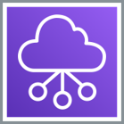
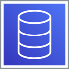

## 1. **Tài liệu**

### 1.1.  Course Agenda

+ Các bạn xem **[Course Agenda](https://drive.google.com/drive/folders/1ZLkHO4c3jcinvn2AD4vl6z4XeH9PjIqj?usp=sharing)**

### 1.2. Tài liệu

+ Các bạn xem **[Tài liệu](https://drive.google.com/drive/folders/1CPHvF4D8bbAnkVtLbhT3i1HPrKF3S-Ru?usp=sharing)**

## 2. Nhóm dịch vụ **Compute**

    

### 2.1. Amazon Elastic Compute Cloud (Amazon EC2) 

    

+ **Amazon EC2** giống với máy chủ ảo hoặc máy chủ vật lý truyền thống. EC2 có **khả năng khởi tạo nhanh , khả năng co dãn tài nguyên mạnh mẽ , linh hoạt**.
+ **Máy chủ ảo :** chia nhỏ máy chủ  vật lý thành **nhiều máy chủ ảo**, mục đích để **tận dụng tài nguyên tốt hơn**.
+ **Amazon EC2** có thể hỗ trợ các workload như lưu trữ web, ứng dụng, cơ sở dữ liệu, dịch vụ xác thực và bất cứ công việc nào khác mà máy chủ thông thường có thể đáp ứng.

### 2.2. Amazon EC2 Auto Scaling

    

+ **EC2 autoscaling :** Khả năng **tăng giảm** số máy chủ ảo, phụ thuộc vào lượng người dùng sử dụng ứng dụng.

### 2.3. AWS Lambda

    

+ **AWS Lambda :** dịch vụ tính toán **phi máy chủ** ( không có máy chủ ) xử lý công việc theo dạng các task nhỏ. 
+ Thực hiện xong công việc trả kết quả xong sẽ **tắt**.  
+ **Giảm** bớt công sức quản lý máy chủ ảo.

### 2.4. AWS Elastic Beanstalk

    

+ **Elastic Beanstalk :** Dịch vụ giúp việc **quản lý** các tài nguyên AWS liên quan tới cùng 1 ứng dụng dễ dàng hơn.

## 3. Nhóm dịch vụ **Container**

    

### 3.1. Amazon Elastic Container Service (Amazon ECS)

    

+ **Amazon ECS** là dịch vụ **quản lý container** với khả năng **mở rộng cao** cho phép đơn giản hóa việc chạy, ngừng chạy và quản lý các container trong cluster. 
+ **Container** sẽ được định nghĩa trong các **task definition** nhằm chạy các task đơn lẻ hoặc nhiều task trong một service.

### 3.2. Amazon Elastic Container Registry (Amazon ECR)

    

+ **AWS ECR** là một dịch vụ **Docker container registry** quản lý hoàn toàn bởi **AWS** nhằm đơn giản hóa việc **lưu trữ, quản lý và triển khai** các **Docker container image**.
+ ECR có thể **tích hợp** được với **Amazon Elastic Container Service (ECS)** nhằm đơn giản hóa việc thiết lập luồng thực hiện triển khai cho các **hệ thống production** cũng như loại bỏ đi sự phức tạp trong việc quản lý kho lưu trữ cho các container image.

### 3.3 Amazon Elastic Kubernetes Service (Amazon EKS)

    

+ **Amazon Elastic Kubernetes Service (Amazon EKS)** là một dịch vụ **container orchestration** được quản lý bởi **AWS** giúp chúng ta để **tạo, quản lý, khởi chạy và thay đổi quy mô** các ứng dụng **Kubernetes** trong môi trường AWS hoặc cả môi trường **on-premise**.

### 3.4. AWS Fargate 

    

+ **AWS Fargate** là một công cụ điện toán **phi máy chủ**, thanh toán theo mức sử dụng cho phép bạn tập trung vào việc xây dựng ứng dụng mà không cần quản lý máy chủ.
+ **AWS Fargate** tương thích với cả **Amazon Elastic Container Service(ECS)** và **Amazon Elastic Kubernetes Service (EKS)**.

## 4. Nhóm dịch vụ **Networking and Content Delivery**

    

### 4.1. Amazon VPC

    

+ **Amazon Virtual Private Cloud (Amazon VPC)** cho phép bạn khởi chạy các tài nguyên AWS vào **một mạng ảo** mà bạn đã xác định.
+ VPC nằm trong **1 Region** , khi tạo VPC cần khai báo 1 lớp mạng **CIDR IPv4** (bắt buộc) và IPv6 (tùy chọn)
+ Giới hạn của VPC hiện tại là **5 VPC trên 1 AWS Region** trên **1 AWS Account**.
+ Mục đích chính sử dụng VPC thường dùng để **phân tách các môi trường**.

### 4.2. Elastic Load Balancing ( ELB )

    

+ **Elastic Load Balancing ( ELB )** là một dịch vụ **cân bằng tải** được quản lý bởi **AWS** , có chức năng **phân phối lưu lượng** cho nhiều **EC2 Instance hoặc Container.** 
+ Sử dụng giao thức **HTTP, HTTPS, TCP và SSL (TCP bảo mật)**.
+ Có thể nằm ở **public hoặc private subnet**.  
+ Mỗi ELB sẽ được cấp tên DNS và kết nối thông qua DNS. 
+ Chỉ có Network Load Balancer hỗ trợ gán IP tĩnh.

### 4.3. Amazon CloudFront

    

+ **Amazon CloudFront** là dịch vụ **phân phối nội dung toàn cầu (CDN)** giúp phân phối một cách bảo mật **dữ liệu, video, ứng dụng và các API** đến người xem với **độ trễ thấp và tốc độ truyền cao.**

### 4.4. AWS Transit Gateway

    

+ **Transit Gateway** được dùng để **kết nối các VPC và mạng on-premises** thông qua một hub trung tâm. Điều này đơn giản hóa mạng và kết thúc các mối quan hệ định tuyến phức tạp. 
+ **Transit Gateway Attachment** là một công cụ để gán các subnet của từng VPC cần kết nối với nhau vào một TGW đã được khởi tạo. 
+ **Transit Gateway Attachment** hoạt động ở quy  mô **Availability Zone (AZ-level)**. 
+ Trong VPC, khi một subnet ở một AZ có Transit Gateway Attachment với một TGW, các subnet khác trong cùng AZ đều có thể kết nối tới TGW đó.

### 4.5. Amazon Route 53

    

+ Amazon Route 53 là một dịch vụ web đám mây (DNS) có khả năng **duy trì mở rộng cao**, **định tuyến end user** đến các ứng dụng Internet

### 4.6 AWS Direct Connect

    

+ **AWS Direct Connect** là dịch vụ cho phép **tạo kết nối riêng** từ trung tâm dữ liệu truyền thống tới AWS
+ Độ trễ khoảng **20 ms – 30 ms**.  
+ AWS Direct Connect ở Việt Nam hiện tại sẽ thông qua **AWS Direct Connect partners** và hoạt động dưới dạng **Hosted Connections.** (Nếu trực tiếp tới AWS thì là **Dedicated Connections).**  
+ Băng thông Direct Connect có thể thay đổi **lên/xuống tùy nhu cầu.**

### 4.7. AWS VPN

    

+ Muốn **kết nối giữa on-premise server và AWS** một cách bảo mật mà không cần nối qua Internet thì VPN là một giải pháp hiệu quả.
+ **VPN Site to Site** dùng trong mô hình hybrid để thiết lập kết nối liên tục giữa môi trường trung tâm dữ liệu truyền thống tới môi trường VPC của AWS. 
+ Việc thiết lập kết nối sẽ cần 2  đầu endpoint ở phía AWS và phía khách hàng :
  + **Virtual Private Gateway** : Được quản lý hoàn toàn bởi AWS (chia 2 endpoints ở 2 đầu AZ).
  + **Customer Gateway** : Đầu endpoint phía khách hàng, có thể là thiết bị phần cứng hoặc software appliance.

## 5. Nhóm dịch vụ **Storage**

    

### 5.1. Amazon Simple Storage Service (S3)

    

+ **Amazon S3** là kho lưu trữ ở mức **đối tượng**, có nghĩa là nếu muốn thay đổi một phần của tập tin, bạn phải thực hiện thay đổi rồi tải lại toàn bộ tập tin đã sửa đổi.

+ S3 phù hợp với các loại dữ liệu ghi một lần đọc nhiều lần **(WORM – Write Once Read Many)**

### 5.2. Amazon Elastic Block Store (EBS) 

    

+ **Amazon EBS** cung cấp **block storage** và được gán trực tiếp vào EC2 Instance , tuy được gán trực tiếp như 1 RAW device, EBS về bản chất hoạt động độc lập với EC2 và được kết nối thông qua mạng riêng của EBS.
+ EBS có hai nhóm đĩa chính là **HDD và SSD**, được thiết kế để đạt **độ sẵn sàng 99.999%** bằng cách replicate dữ liệu giữa **3 Storage Node trong 1 AZ**

### 5.3. Amazon Elastic File System (EFS)

    

+ **EFS ( Elastic File System )** cho phép tạo các **NFSv4 Network volume** và gán vào nhiều EC2 Instances cùng lúc, quy mô lưu trữ lên đến hàng **petrabyte**. 

+ EFS chỉ support **Linux**.  
+ Sử dụng EFS chỉ tính chi phí theo dung lượng sử dụng ( trong khi EBS tính phí theo dung lượng cấp phát ).

+ EFS có thể được cấu hình để **mount** vào môi trường **on-premise qua DX hoặc VPN**.

## 6. Nhóm dịch vụ **Database**

    

### 6.1. Amazon Relational Database Service (Amazon RDS)

    

+ Là **cơ sở dữ liệu** được quản lý trên AWS, chúng ta chỉ truy cập và quản lý ở mức RDBMS, không thể truy cập và quản lý ở mức hệ điều hành. 
+ Bao gồm **Aurora, MySQL, Postgre SQL , MSSQL, Oracle , Maria.**

### 6.2. Amazon Aurora

    

+ **Amazon Aurora** là một công cụ **cơ sở dữ liệu quan hệ** được tối ưu lại hạ tầng lưu trữ bên dưới, cho hiệu năng **đọc ghi song song** cao. 
+ Nền tảng RDBMS có 2 lựa chọn là **MySQL và PostgreSQL**.

### 6.3. Amazon RedShift

    

+ **Amazon Redshift** là dịch vụ **Data warehouse** được quản lý bởi AWS. 
+ Lõi là **Postgresql** nhưng được tối ưu cho **OLAP**.

### 6.4. Amazon Dynamo

    

+ **Amazon Dynamodb** là dịch vụ **CSDL NoSQL** dạng **Key-Value , Key-Document** nhanh và linh hoạt được quản lý bởi AWS.

## 7. Nhóm dịch vụ **AWS Cost Management**

    

### 7.1. AWS Cost and Usage Report

    

+ **AWS Cost & Usage Report** chứa những thông tin cụ thể nhất về **dữ liệu chi phí và mức sử dụng**. 
+ Nó bao gồm những siêu dữ liệu được bổ sung về **dịch vụ AWS, giá cả và các phương án trả trước** ( ví dụ: Amazon EC2 Reserved Instances)

### 7.2. AWS Budgets

    

+ **AWS Budget** là một dịch vụ cung cấp khả năng **thiết lập ngân sách** để gửi cảnh báo cho bạn khi chi phí vượt quá chi phí mà ngân sách cho phép (hoặc được dự báo sẽ vượt quá ngân sách).

### 7.3. AWS Cost Explorer

    

+ **AWS Cost Explorer** cung cấp báo cáo mặc định giúp bạn **theo dõi chi phí và mức sử dụng** liên quan đến năm dịch vụ AWS tích lũy chi phí hàng đầu.
+ Cung cấp cho bạn **bảng phân tích chi tiết** về tất cả dịch vụ ở chế độ xem bảng.

## 8. Nhóm dịch vụ **Security**

    

### 8.1.  Identity and Access Management (IAM) 

    

+ **IAM** là dịch vụ giúp bạn **kiểm soát quyền truy cập** vào các dịch vụ và tài nguyên trong AWS account của mình. 
+ IAM cho phép bạn **tạo nhiều tài khoản** người dùng (IAM user) với **thông tin xác thực** (credentials) và **quyền hạn** khác nhau.

### 8.2. AWS Organizations

    

+ **AWS Organizations** giúp **quản lý và điều hành tập trung** môi trường của mình bao gồm nhiều AWS account.
+ AWS Organizations có thể **tạo các tài khoản AWS mới và phân bổ tài nguyên**, sắp xếp các AWS account theo **OU (Organization Unit)**, đồng thời đơn giản việc **thanh toán tập trung**.

### 8.3. Amazon Cognito

    

+ **Amazon Cognito** là dịch vụ được quản lý bởi AWS có chức năng **xác thực, cấp phép và quản lý người dùng** cho các ứng dụng web và di động. 
+ Người dùng có thể **đăng nhập** trực tiếp bằng tên người dùng và mật khẩu hoặc thông qua một bên thứ ba như **Facebook, Amazon hoặc Google**.

### 8.4. AWS Artifact

    

+ **AWS Artifact** là **tài nguyên tập trung, tổng hợp** cho thông tin liên quan đến việc tuân thủ quan trọng đối với bạn. 
+ Tài nguyên này cung cấp **quyền truy cập** theo nhu cầu vào các **báo cáo bảo mật** và tuân thủ của AWS cũng như một số thỏa thuận trực tuyến.

### 8.5. AWS Key Management Service (AWS KMS)

    

+ **AWS Key Management Service** giúp tạo và quản lý các **encryption key**, phục vụ cho mục đích **encrypt/decrypt** dữ liệu trên AWS. ( Encryption at rest )  
+ Encryption key luôn nằm trong AWS KMS , đảm bảo tiêu chuẩn FIPS 140-2.  
+ CMK ( Customer Managed Key ) đóng vai trò là tài nguyên chính trong AWS KMS. 
+ CMK có thể có kích thước tới 4KB. 
+ Tuy nhiên thông thường, chúng ta chỉ sử dụng CMK cho mục đích tạo, mã hóa và giải mã Data Key – loại khóa được dùng bên ngoài AWS KMS để mã hóa dữ liệu.

### 8.6. AWS Shield 

    

+ **AWS Shield** là dịch vụ bảo vệ khỏi tấn công **Từ chối dịch vụ phân tán (DDoS)** gúp bảo vệ các ứng dụng chạy trên AWS.

## 9. Nhóm dịch vụ **Management and Governance**

    

### 9.1. AWS Management Console

    

+ **AWS Management Console** là một ứng dụng web/di động dùng để **quản lý điều khiển các dịch vụ** của Amazon Web Services. 
+ Khi bạn đăng nhập lần đầu tiên, bạn sẽ thấy trang chủ của trình quản lý dịch vụ AWS. 
+ Trình quản lý điều khiển dịch vụ AWS sẽ bao gồm danh sách các dịch vụ khác nhau để lựa chọn sử dụng.

### 9.2. AWS Config

    

+ **AWS Config** là dịch vụ cho phép bạn **ước lượng, kiểm tra và đánh giá cấu hình** các tài nguyên AWS của bạn. 
+ **Config** sẽ liên tục theo dõi và ghi hồ sơ các cấu hình tài nguyên AWS của bạn và cho phép bạn tự động hóa việc đánh giá các cấu hình được ghi lại so với các cấu hình mong muốn.

### 9.3. AWS CloudWatch

    

+ **Amazon CloudWatch** là một công cụ cho phép bạn **thu thập dữ liệu** về hoạt động của các tài nguyên, ứng dụng, và dịch vụ đang vận hành trên AWS Cloud hoặc máy chủ của bạn. 
+ Dữ liệu thu thập được sẽ được lưu dưới dạng các **nhật ký, chỉ số, và sự kiện**. 
+ Cloudwatch cũng có thể thể hiện dữ liệu dưới **dạng biểu đồ** để bạn dễ dàng hình dung và chắt lọc thông tin từ dữ liệu.

### 9.4. AWS Auto Scaling

    

+ **AWS Auto Scaling** là tính năng **tự động nhân rộng** để đảm bảo rằng các phiên bản Amazon EC2 đủ để chạy các ứng dụng của bạn. 
+ Bạn có thể tạo một nhóm AWS Auto Scaling trong các phiên bản EC2.

### 9.5. AWS Command Line Interface

    

+ **AWS Command Line Interface (AWS CLI)** là một công cụ **mã nguồn mở** (open source)
+ Dùng **tương tác với các dịch vụ AWS** bằng cách sử dụng các lệnh trong **cửa sổ lệnh** (command-line shell). 

### 9.6. AWS Trusted Advisor

    

+ **AWS Trusted Advisor** cung cấp các **đề xuất** giúp bạn tuân theo những **biện pháp thực hành tốt nhất** về AWS. 
+ **Trusted Advisor** đánh giá tài khoản của bạn bằng các nội dung kiểm tra.

### 9.7. AWS Well-Architected Tool

    

+ **AWS Well-Architected Tool** có sẵn miễn phí trong Bảng điều khiển quản lý AWS, cung cấp **cơ chế** để thường xuyên **đánh giá khối lượng công việc, xác định các vấn đề rủi ro** cao và **ghi lại các cải tiến**.

### 9.8. CloudTrail

    

+ **CloudTrail** là dịch vụ **ghi lại các lệnh gọi API (API call )** AWS cho tài khoản của bạn và **lưu thông tin vào log.** 
+ Tương tác tới tài khoản AWS của bạn thông qua **Managment Console , CLI hay SDK** đều là các lệnh gọi API.

## 10. **Câu hỏi FAQ**

+ Các bạn đặt câu hỏi tại [AWS Re/Start FAQ](https://docs.google.com/document/d/1bLPB57WPRGkpvGAAUpuV5cWn3DVQJrhpVL7LOWkMHJg/edit?usp=sharing)

## 11. **Tham khảo các câu hỏi thường gặp tại [FAQ](https://docs.google.com/spreadsheets/d/1oEGUUxPOg3webrfOXhpU_n3Qt2VfgOPhi0BdIbkUUOQ/edit?usp=sharing)**
 
+ Danh sách FAQ của 39 dịch vụ [AWS](https://docs.google.com/spreadsheets/d/1oEGUUxPOg3webrfOXhpU_n3Qt2VfgOPhi0BdIbkUUOQ/edit?usp=sharing)

## 12. **Extra mission**

+ Tiếp tục với [FCJ Special Force](https://van-hoang-kha.github.io/FCJ-Special-Force/)
